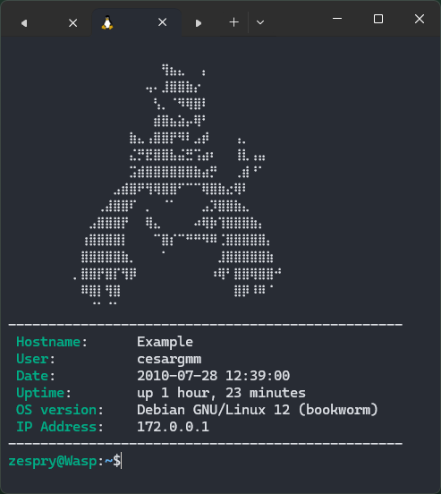

# Ansible Role - TUI

This role will customize your Linux Text-based User Interface (TUI) with a Welcome message and useful system
information.

```text⠀⠀⠀⠀⠀⠀⠀⠀⠀⠀⠀⠀⠀⠀⠀⠀⠀⠀⠀⠀⠀⠀⠀⠀⠀⠀⠀⠀⠀⠀
✨⠀⠀⠀⠀⠀⠀⠀⠀⠀⢠⣖⡒⠢⢄⡀⠀⠀⠀⠀⠀⠀⠀⠀⠀⠀⠀⠀⠀⠀⠀
⠀⠀⠀⠀⠀⠀⠀⠀⠀⠀⠀⢸⣿⣇⠀⠀⠈⢦⡀⠀⠀⠀⠀⠀⠀⠀⠀⠀⠀⠀⠀⠀
⠀⠀⠀⠀⠀⠀⠀⠀⠀⠀⠀⣰⣿⣿⠀⠀⠀⢠⣿⠉⠒⠢⠤⣀⠀⠀⠀⠀⠀⠀⠀⠀
⠀⠀⠀⠀⠀⠀⠀⠀⢀⠔⠊⢀⣳⣤⣤⣶⣾⣿⣿⣦⣤⣤⣤⣾⣿⣦⠀⠀⠀⠀⠀⠀
⠀⠀⠀⠀⠀⠀⠀⢸⣿⡷⣾⡟⣟⢭⠙⠛⢱⣲⢹⢻⣿⣿⣿⡿⣿⣿⡀⠀⠀⠀⠀⠀
⠀⠀⠀⠀⠀⠀⠀⠀⣿⣿⢠⢣⣯⡛⠀⠄⠈⠋⢀⡆⣿⡏⠁⠀⢸⣿⡇⠀⠀⠀⠀⠀
⠀⠀⠀⠀⠀⠀⠀⠀⠛⠻⡚⠺⠿⠟⢓⣢⡀⠚⠓⠚⠛⠃⢂⠄⠈⠉⠁⠀⠀⠀⠀⠀
⠀⠀⠀⠀⠀⠀⠀⠀⠀⠈⠲⣀⠤⢲⠻⣐⡸⣀⢹⣶⣤⣀⠖⠁⠀⠀⠀⠀⠀⠀⠀⠀
⠀⠀⠀⠀⠀⢀⠤⠒⠒⠤⣀⡠⠔⢇⠀⣀⡸⣆⠇⢹⣿⣿⣷⠢⠤⣀⠀⠀⠀⠀⠀⠀
⠀⠀⠀⠀⠀⠀⠉⡆⠀⠀⠀⢀⡠⠋⠓⠁⠀⠀⠀⢾⣿⣿⣿⣧⠀⠀⣑⡢⠀⠀⠀⠀
⠀⠀⠀⠀⠀⠀⠀⠈⠢⠤⠊⠁⠀⠀⠀⠀⠀⠀⠀⠀⠉⠁⠈⠻⠧⠊⠀⠀⠀⠀⠀⠀⠀⠀⠀⠀⠀⠀⠀⠀⠀⠀⠀⠀⠀⠀⠀⠀⠀⠀⠀⠀
```

> [!WARNING]
> This role override your current .profile file. If you don't want to lose your current configuration, please
> make a backup of your current .profile file.

## Requirements

* Bash shell

## Role variables

| Variable           | Description                          | Default              |
|--------------------|--------------------------------------|----------------------|
| color_schema       | Color schema for the Welcome message | `yellow`             |
| image_color_schema | Color schema for the image           | `{{ color_schema }}` |
| image_path         | Path to images folder                | `files/images/`      |
| image              | Name of the image file               | `jirachi`            |

## Example playbook

You can use the following playbook to test the role in your own machine:

```yaml
---
# playbooks/main.yml
- hosts: localhost
  roles:
    - ansible-role-tui
```

```yaml
---
# inventory/hosts.yml
[localhost]
127.0.0.1
```

Here are some ansible-playbook command examples:

```bash
ansible-playbook -K -c local -i inventory/hosts playbooks/main.yml
```


```bash
ansible-playbook -K -c local -e color_schema=magenta -e image=mew -D -i inventory/hosts playbooks/main.yml
```


```bash
ansible-playbook -K -c local -e image_color_schema=white -e color_schema=cyan -e image=lugia -D -i inventory/hosts playbooks/main.yml
```


> [!WARNING]
> This role won't work if your default shell is not `bash`.